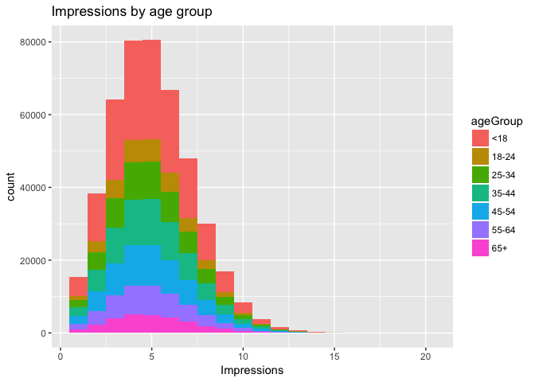
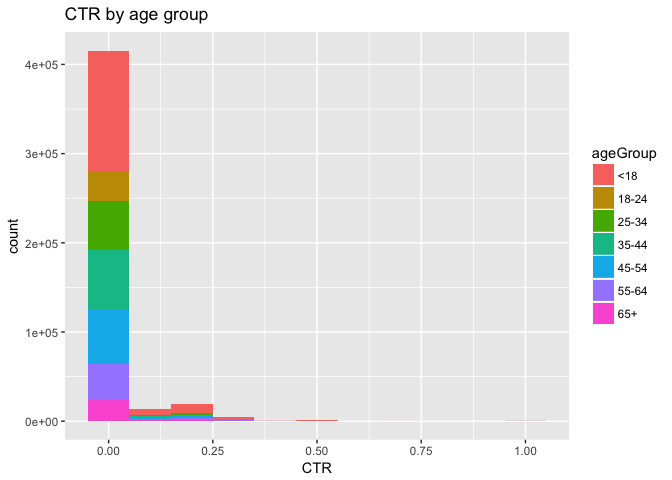
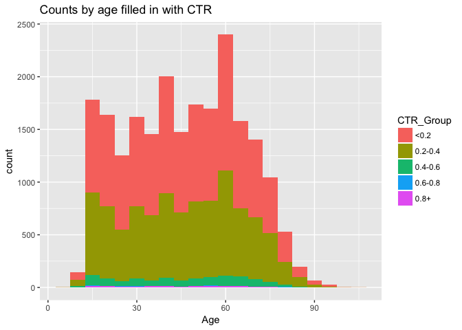

# WK10HW
Chiranjeevi Mallavarapu  
7/20/2017  

# This is HW10 for Week 10

---

# Load the required library


```r
library(ggplot2)
```
# 1) Load data from	http://stat.columbia.edu/~rachel/datasets/nyt1.csv


```r
knitr::opts_chunk$set(echo = TRUE, include = TRUE)
fileLocation <- "http://stat.columbia.edu/~rachel/datasets/nyt1.csv"
data1 <- read.csv(url(fileLocation))
```

# 2) Create a new variable ageGroup that categorizes age into following groups: < 18, 18–24, 25–34, 35–44, 45–54, 55–64 and 65+.


```r
knitr::opts_chunk$set(echo = TRUE, include = TRUE)
data1$ageGroup  <- cut(data1$Age, c(-Inf, 18, 24, 34, 44, 54, 64, Inf))
levels(data1$ageGroup) <- c("<18", "18-24", "25-34", "35-44", "45-54", "55-64", "65+")
head(data1)
```

```
##   Age Gender Impressions Clicks Signed_In ageGroup
## 1  36      0           3      0         1    35-44
## 2  73      1           3      0         1      65+
## 3  30      0           3      0         1    25-34
## 4  49      1           3      0         1    45-54
## 5  47      1          11      0         1    45-54
## 6  47      0          11      1         1    45-54
```

# 3) Use sub set of data called “ImpSub” where Impressions > 0 ) in your data set.


```r
knitr::opts_chunk$set(echo = TRUE, include = TRUE)
ImpSub <- subset(data1, Impressions>0)
summary(ImpSub)
```

```
##       Age             Gender        Impressions         Clicks       
##  Min.   :  0.00   Min.   :0.0000   Min.   : 1.000   Min.   :0.00000  
##  1st Qu.:  0.00   1st Qu.:0.0000   1st Qu.: 3.000   1st Qu.:0.00000  
##  Median : 31.00   Median :0.0000   Median : 5.000   Median :0.00000  
##  Mean   : 29.48   Mean   :0.3671   Mean   : 5.041   Mean   :0.09322  
##  3rd Qu.: 48.00   3rd Qu.:1.0000   3rd Qu.: 6.000   3rd Qu.:0.00000  
##  Max.   :108.00   Max.   :1.0000   Max.   :20.000   Max.   :4.00000  
##                                                                      
##    Signed_In      ageGroup     
##  Min.   :0.000   <18  :155303  
##  1st Qu.:0.000   18-24: 35014  
##  Median :1.000   25-34: 57801  
##  Mean   :0.701   35-44: 70394  
##  3rd Qu.:1.000   45-54: 63845  
##  Max.   :1.000   55-64: 44462  
##                  65+  : 28556
```

# 4) Create a new variable called click-through-rate (CTR = click/impression).


```r
knitr::opts_chunk$set(echo = TRUE, include = TRUE)
ImpSub$CTR <- ImpSub$Clicks/ImpSub$Impressions
head(ImpSub)
```

```
##   Age Gender Impressions Clicks Signed_In ageGroup        CTR
## 1  36      0           3      0         1    35-44 0.00000000
## 2  73      1           3      0         1      65+ 0.00000000
## 3  30      0           3      0         1    25-34 0.00000000
## 4  49      1           3      0         1    45-54 0.00000000
## 5  47      1          11      0         1    45-54 0.00000000
## 6  47      0          11      1         1    45-54 0.09090909
```

# 5) Plot distributions of number impressions and click-through-rate (CTR = click/impression) for the age groups.


```r
knitr::opts_chunk$set(echo = TRUE, include = TRUE)
ggplot(ImpSub, aes(x=Impressions, fill=ageGroup))+   labs(title="Impressions by age group")+geom_histogram(binwidth=1)
```

<!-- -->

```r
ggplot(ImpSub, aes(x=CTR, fill=ageGroup))+   labs(title="CTR by age group")+geom_histogram(binwidth=0.1)
```

<!-- -->

# 6) Define a new variable to segment users based on click -through-rate (CTR) behavior CTR< 0.2, 0.2<=CTR <0.4, 0.4<= CTR<0.6, 0.6<=CTR<0.8, CTR>0.8	


```r
knitr::opts_chunk$set(echo = TRUE, include = TRUE)
ImpSub$CTR_Group <- cut(ImpSub$CTR, c(-Inf,0.2, 0.4,0.6, 0.8, Inf),right = FALSE)
levels(ImpSub$CTR_Group) <- c("<0.2", "0.2-0.4", "0.4-0.6", "0.6-0.8", "0.8+")
head(ImpSub)
```

```
##   Age Gender Impressions Clicks Signed_In ageGroup        CTR CTR_Group
## 1  36      0           3      0         1    35-44 0.00000000      <0.2
## 2  73      1           3      0         1      65+ 0.00000000      <0.2
## 3  30      0           3      0         1    25-34 0.00000000      <0.2
## 4  49      1           3      0         1    45-54 0.00000000      <0.2
## 5  47      1          11      0         1    45-54 0.00000000      <0.2
## 6  47      0          11      1         1    45-54 0.09090909      <0.2
```

# 7) Get the total number of Male, Impressions, Clicks and Signed_In (0=Female, 1=Male)


```r
knitr::opts_chunk$set(echo = TRUE, include = TRUE)
sapply(ImpSub[,c(2,3,4,5)],sum)
```

```
##      Gender Impressions      Clicks   Signed_In 
##      167146     2295559       42449      319198
```

# 8) Get the mean of Age, Impressions, Clicks, CTR and percentage of males and signed_In 


```r
knitr::opts_chunk$set(echo = TRUE, include = TRUE)
sapply(ImpSub[,c(1,2,3,4,5,7)],mean)
```

```
##         Age      Gender Impressions      Clicks   Signed_In         CTR 
## 29.48400988  0.36705133  5.04102992  0.09321768  0.70095635  0.01847053
```

# 9) Get the means of Impressions, Clicks, CTR and percentage of males and signed_In  by AgeGroup.


```r
knitr::opts_chunk$set(echo = TRUE, include = TRUE)
aggregate(ImpSub[,c(2,3,4,5,7)], by=list(Category=ImpSub$ageGroup), FUN=mean)
```

```
##   Category    Gender Impressions     Clicks Signed_In         CTR
## 1      <18 0.0790648    5.033534 0.14167788 0.1231528 0.028141310
## 2    18-24 0.5339864    5.043240 0.04880905 1.0000000 0.009720481
## 3    25-34 0.5319977    5.026055 0.05081227 1.0000000 0.010146329
## 4    35-44 0.5317072    5.054749 0.05202148 1.0000000 0.010286330
## 5    45-54 0.5292192    5.045172 0.05062260 1.0000000 0.009957612
## 6    55-64 0.5359633    5.053484 0.10246952 1.0000000 0.020306816
## 7      65+ 0.3632512    5.046925 0.15233226 1.0000000 0.029802702
```

# 10) Create a table of CTRGroup vs AgeGroup counts.


```r
knitr::opts_chunk$set(echo = TRUE, include = TRUE)
CountAgeGrp.tab <- table(ImpSub$ageGroup,ImpSub$CTR_Group)
CountAgeGrp.tab
```

```
##        
##           <0.2 0.2-0.4 0.4-0.6 0.6-0.8   0.8+
##   <18   144976    8913    1168      84    162
##   18-24  34256     669      74       2     13
##   25-34  56462    1203     110       7     19
##   35-44  68749    1489     124       4     28
##   45-54  62369    1331     125       0     20
##   55-64  42424    1793     201       8     36
##   65+    26587    1742     195      11     21
```

# 11) Plot distributions of number impressions and click-through-rate (CTR = click/impression) for the age groups


```r
knitr::opts_chunk$set(echo = TRUE, include = TRUE)
# Pls. refer to question 5)
```

# 12) One more plot you think which is important to look at.I am choosing to plot count of count by Age filled by CTR to is which age is most active 


```r
knitr::opts_chunk$set(echo = TRUE, include = TRUE)
AgeClickNZ <- ImpSub[ImpSub$Age >0 & ImpSub$CTR >0,]
ggplot(AgeClickNZ, aes(x=Age, fill=CTR_Group))+   labs(title="Counts by age filled in with CTR")+geom_histogram(binwidth=5)
```

<!-- -->

## Seems like mostly people aged 60 years are highly active 
